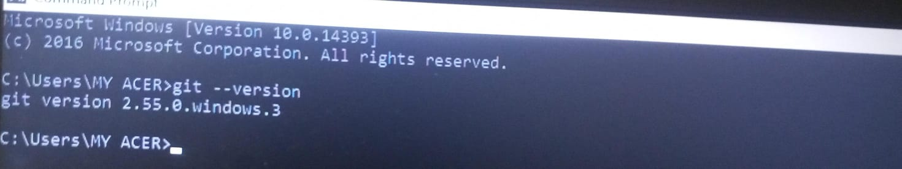
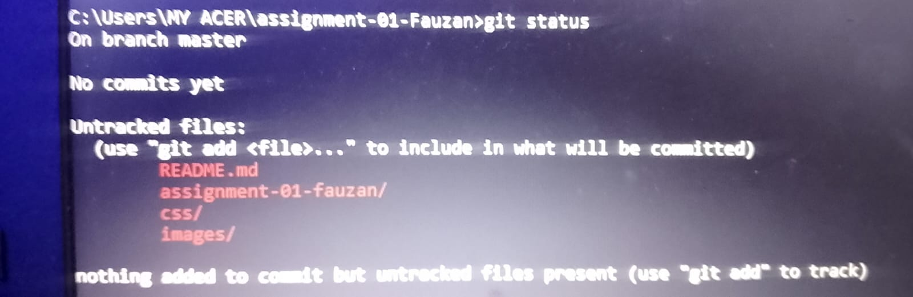
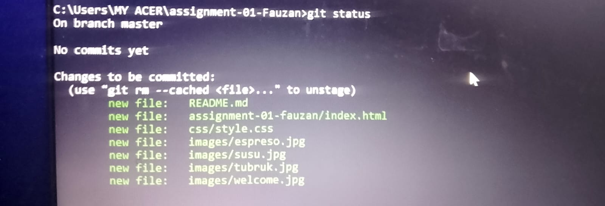
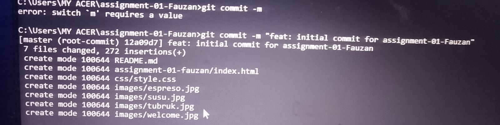
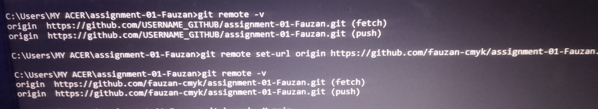
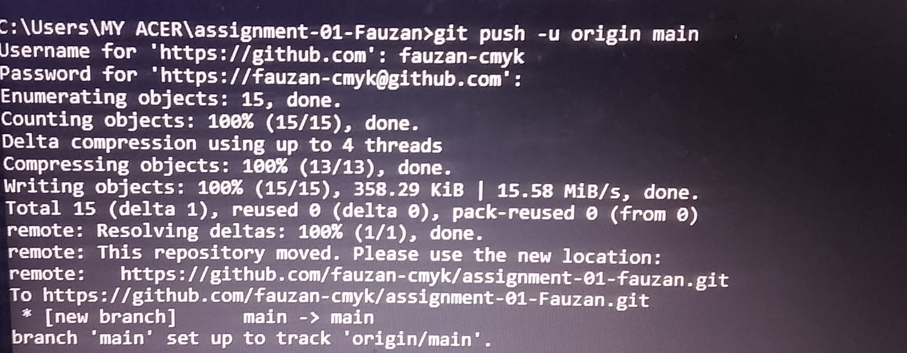
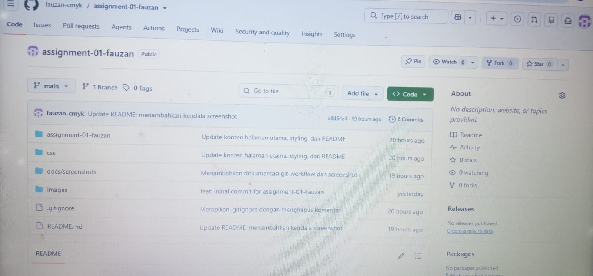
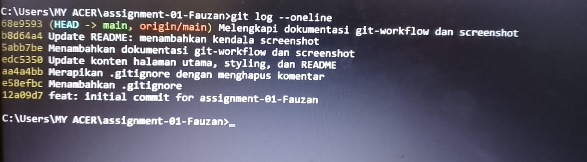

# Git Workflow — Assignment #2

**Repository:** 
https://github.com/fauzan-cmyk/assignment-01-fauzan

## 1. Persiapan Git
 Sebelum mulai, saya mengecek apakah Git sudah terinstal

```
 Command: git --version
```

```
 Hasil: git version 2.55.0.windows.3
```

 

## 2. Pembuatan Repository
Repository dibuat langsung di Github dan opsi"Add README"nya tidak di ceklis karena akan di tambahkan dari sisi lokal


## 3. Inisialisasi Git pada Project
Menjalankan perintah `git init` untuk menjadikan folder tersebut menjadi repository lokal

```
Command: git init
```

```
Hasil: Initialized empty Git repository in C:/Users/MY ACER/assignment-01-Fauzan/.git/
```


## 4. Pemeriksaan Perubahan File
Untuk melihat file apa saja yang belum ditrack oleh Git,menggunakan peerintah berikut:
```
Command: git status
```

```
Hasil: Untracked files - README.md, assignment-01-fauzan/, css/, images/
```


## 5. Proses Staging
File yang sudah di periksa kemudian di pindahkan ke staging area
```
Command: git add .
```

```
Hasil: Changes to be committed - new file README.md, index.html, style.css, dan file gambar lainnya
```


## 6. Pembuatan Commit
Setelah file berada di staging area,dilakukan commit dengan pesan yang menjelaskan perubahan
```
Command: git commit -m "feat: initial commit for assignment-01-Fauzan"
```

```
Hasil: [master (root-commit) 12a09d7] feat: initial commit for assignment-01-Fauzan, 7 files changed, 272 insertions(+)
```


## 7. Menghubungkan Repository Lokal dan Remote
Repository lokal dihubungkan ke repository GitHub,lalu dicek koneksinya
```
Command: git remote add origin https://github.com/fauzan-cmyk/assignment-01-fauzan.git
```

```
Command: git remote -v
```

```
Hasil: origin https://github.com/fauzan-cmyk/assignment-01-fauzan.git (fetch) dan (push)
```



## 8. Mengirim Project ke GitHub
```
Command: git branch -M main
```

```
Command: git push -u origin main
```

```
Hasil: [new branch] main -> main, branch 'main' set up to track 'origin/main'
```



## 9. Melakukan Perubahan Lanjutan pada Project
Setelah push pertama,dilakukan beberapa perubahan kecil pada project diikuti staging,commit,dan push

```
Command:git add .
```

```
Command: git commit -m "Merapikan .gitignore dengan menghapus komentar"
```

```
Command: git push
```



## 10. Melihat Riwayat Commit
Riwayat seluruh commit dapat dilihat dengan perinta berikut

```
Command: git log --oneline
```

```
Hasil: menampilkan seluruh commit secara ringkas, urut dari yang terbaru ke terlama
```



## 11. Kendala yang Ditemukan
-Password di tolak GitHub sehingga menggunakan Personal Access Token (PAT).
-Salah mengetik huruf pada nama repository jadi harus di perbaiki dengan git remote set-url.
-Sulit untuk screenshot jadi pake hp untuk fotonya.

## 12. Kesimpulan
Alur kerja Git secara bertahap,perubahan di periksa menggunakan git status,lalu dipindahkan ke staging dengan git add,disimpan sebagai commit dengan git commit,lalu dikirim ke GitHub dengan git push