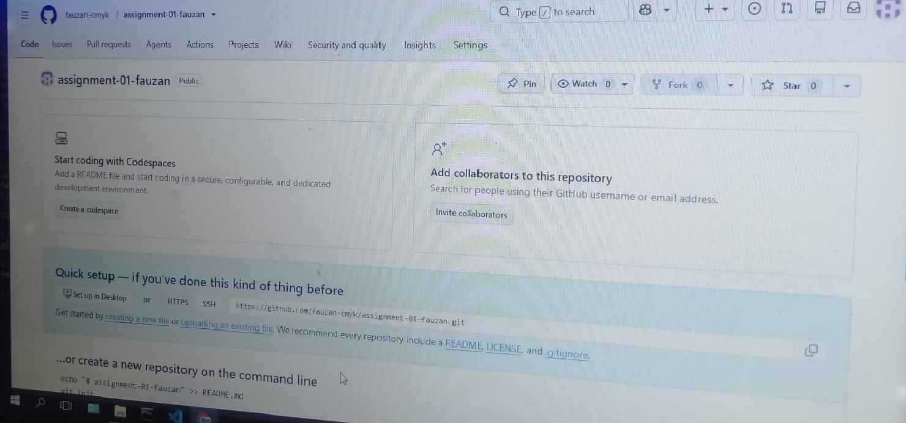
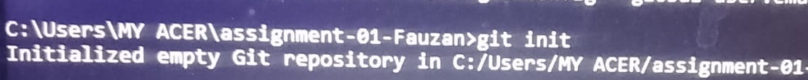

# Git Workflow — Assignment #2

Dokumentasi ini menjelaskan proses pengelolaan project **assignment-01-fauzan** menggunakan Git, mulai dari persiapan hingga project berhasil tersedia di GitHub.

**Repository:** [github.com/fauzan-cmyk/assignment-01-fauzan](https://github.com/fauzan-cmyk/assignment-01-fauzan)

---

## 1. Persiapan Git

Cek instalasi Git di CMD:

```
git --version
```
```
git version 2.55.0.windows.3
```


---

## 2. Pembuatan Repository

Repository dibuat di GitHub dengan nama `assignment-01-fauzan`, tanpa opsi "Add README" karena README ditambahkan dari lokal.



---

## 3. Inisialisasi Git pada Project

```
cd assignment-01-Fauzan
git init
```

Membuat folder `.git` tersembunyi sebagai repository lokal.



---

## 4. Pemeriksaan Perubahan File

```
git status
```
```
On branch main
Untracked files:
        .gitignore
```


---

## 5. Proses Staging

```
git add .gitignore
```

File berubah status dari untracked menjadi staged, siap di-commit.


---

## 6. Pembuatan Commit

```
git commit -m "Menambahkan .gitignore"
```
```
[main e58efbc] Menambahkan .gitignore
 1 file changed, 25 insertions(+)
 create mode 100644 .gitignore
```


---

## 7. Menghubungkan Repository Lokal dan Remote

```
git remote add origin https://github.com/fauzan-cmyk/assignment-01-fauzan.git
git remote -v
```

URL remote sempat diperbaiki dengan `git remote set-url origin <url>` karena perbedaan huruf besar/kecil pada nama repo.


---

## 8. Mengirim Project ke GitHub

```
git branch -M main
git push -u origin main
```

Autentikasi menggunakan username GitHub dan **Personal Access Token (PAT)**, karena GitHub tidak lagi menerima password akun biasa untuk push via HTTPS.


---

## 9. Melakukan Perubahan Lanjutan pada Project

Beberapa perubahan kecil dilakukan setelah push pertama, masing-masing diikuti staging, commit, dan push.

**Perubahan 1 — Merapikan `.gitignore`** (menghapus baris komentar):
```
git add .gitignore
git commit -m "Merapikan .gitignore dengan menghapus komentar"
git push
```


**Perubahan 2 — Update `index.html`, `style.css`, dan `README.md`:**
```
git add .
git commit -m "Update konten halaman utama, styling, dan README"
git push
```


---

## 10. Melihat Riwayat Commit

```
git log --oneline
```
```
edc5350 Update konten halaman utama, styling, dan README
aa4a4bb Merapikan .gitignore dengan menghapus komentar
e58efbc Menambahkan .gitignore
12a09d7 feat: initial commit for assignment-01-Fauzan
```


---

## 11. Kendala yang Ditemukan

- **Remote sudah ada (`remote origin already exists`)** — diselesaikan dengan mengecek remote via `git remote -v`, lalu memperbaikinya dengan `git remote set-url origin <url>`.
- **Autentikasi password ditolak GitHub** — GitHub tidak lagi menerima password akun biasa untuk push HTTPS, sehingga digunakan **Personal Access Token (PAT)**.
- **Perbedaan huruf besar/kecil pada nama repository** — sempat muncul peringatan "This repository moved" karena nama folder lokal beda huruf dengan nama repo di GitHub; diperbaiki dengan `git remote set-url`.
- **Kesulitan mengambil screenshot** — tombol PrtScn dan Snipping Tool tidak merespon, sehingga dokumentasi visual diambil lewat kamera HP lalu dipindahkan ke laptop.
- **File belum lengkap tersalin sebelum commit** — sempat ada commit yang hanya menyertakan satu file karena file lain belum selesai dipindahkan saat `git add` dijalankan.

---

## 12. Kesimpulan

Git bekerja dalam alur bertahap: perubahan diperiksa dengan `git status`, dipindahkan ke staging dengan `git add`, disimpan sebagai commit dengan `git commit`, lalu dikirim ke GitHub dengan `git push`. Commit kecil dan bertahap dengan pesan yang jelas membuat riwayat proyek (`git log`) lebih mudah dipahami dibanding satu commit besar di akhir, dan `.gitignore` membantu menjaga file yang tidak relevan tidak ikut masuk ke repository.
